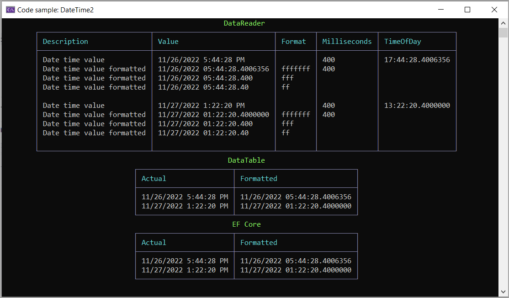

# About

Some exploration of datetime2(7) precision.

Backend work is done in the class project `SqlServerLibrary`

:high_brightness: [Example](http://sqlfiddle.com/#!18/20fa5a/1), read to run online.

- First example uses `SqlConnection`, `SqlCommand` and `SqlDataReader`
- Second example used `EF Core 7`

## Schema

## Results from running this app

