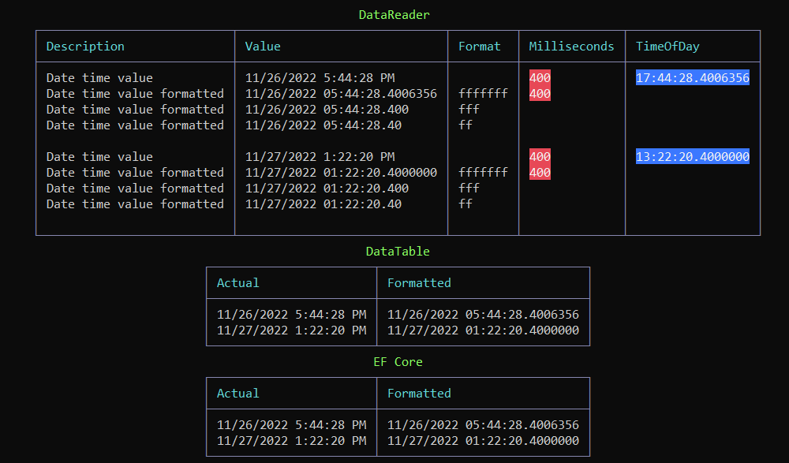

# SQL-Server: Exploration of datetime2(7) precision

## Introduction

In this article with code samples, learn about using datetime2 precision.

**What is datetime2?**

Defines a date that is combined with a time of day that is based on 24-hour clock. datetime2 can be considered as an extension of the existing datetime type that has a larger date range, a larger default fractional precision, and optional user-specified precision.

**Precision scale**

We tend to define a datetime2(**7**) where in this case **7** is the precision and can range from 0 to 7. This means in a table if the default 7 is not need, use the precision which works best for given business requirements or leave as 7.

Typically developers don’t need to be concerned with milliseconds part of a date but when needed using datetime2 provides milliseconds. Write a query with a column of type datetime2 and milliseconds are display. Now write code using C# to return data from the same query to a DataTable, DataSet, DataReader or Entity Framework and note it appears milliseconds has been truncated. Below learn how to get full milliseconds in C# no matter how the data is retrieved and how to format milliseconds in a user interface.

## Diving in working with datetime2 precision

When working with [datetime2(7)](https://learn.microsoft.com/en-us/sql/t-sql/data-types/datetime2-transact-sql?view=sql-server-ver16) in a SQL-Server table we see time as hours, minutes, seconds and milliseconds.

**Example table definition**


Write a simple `SELECT` statement.

```sql
SELECT Id,
       [User],
       Created
FROM dbo.AuditLog;
```

Returns


Now we know that milliseconds are properly stored, time to read the records into a C# application using either a DataReader, DataTable or Entity Framework Core and for the first record the expected value for Created column should be `2022-11-26 17:44:28.4006356` but what the DataReader, DataTable or Entity Framework Core returns is `2022-11-26 17:44:28.400`. This can be frustrating to a developer that does not understand what is happening.


</br>


If we look at `TimeOfDay.TotalSeconds` the `fraction` is out `milliseconds`. Knowing this let's create a languge extension to get milliseconds, the fraction part of TotalSeconds.


```csharp
public static class Extensions
{
    public static decimal GetMilliseconds(this double sender) 
       => Convert.ToDecimal(sender) % 1.0m;
}
```

Well that is partly there, let's get the method to return an `int` rather than  a `decimal`

```csharp
public static class Extensions
{
    public static int GetMilliseconds(this double sender) 
        => Convert.ToInt32(Convert.ToString(Convert.ToDecimal(sender) % 1.0m, 
               CultureInfo.InvariantCulture).Replace("0.", ""));
}
```

**Usage**

```csharp
int milliseconds = created.TimeOfDay.TotalSeconds.GetMilliseconds();
```

:heavy_check_mark: Wait, we can do even better. Note .ToString is used as we do not want to add Milliseconds and Milliseconds, that is incorrect, instead perform string concatenation.

```csharp
public static class Extensions
{
    public static int GetMilliseconds(this DateTime sender) 
        => Convert.ToInt32(sender.TimeOfDay.Milliseconds.ToString() + 
               sender.TimeOfDay.Milliseconds.ToString());
}
```

Perhaps one more update, if the requirements is to get precision to 7 the last method does not but the following does.

```csharp
public static class Extensions
{
    public static int GetMilliseconds7(this DateTime sender) 
        => Convert.ToInt32((sender.TimeOfDay.Milliseconds.ToString() + sender.TimeOfDay.Microseconds.ToString())
            .PadRight(7, '0'));
}
```

In this case we use

```csharp
created.GetMilliseconds();
```

Or

```csharp
created.GetMilliseconds7();
```


## Formatting

If all that is needed is to format milliseconds and the precisions is unknown. First query the database using the following statement in SSMS.

```sql
SELECT 	TABLE_NAME,COLUMN_NAME,DATETIME_PRECISION FROM INFORMATION_SCHEMA.COLUMNS WHERE  DATA_TYPE = 'datetime2';
```

For C# provided in the project `SqlServerLibrary` and used in the project `SqlServerDateTime2PrecisionApp` with a DataReader, DataTable and EF Core 7.

```csharp
public static (List<DateTimeInformation> list, bool hasColumns) GetDateTimeInformation(string connectionString, string tableName)
{
    List<DateTimeInformation> dateTimeInfoList = new();
    var sql =
        "SELECT TABLE_NAME,COLUMN_NAME,DATETIME_PRECISION " + 
        "FROM INFORMATION_SCHEMA.COLUMNS WHERE DATA_TYPE = 'datetime2' AND TABLE_NAME = @TableName;";

    using var cn = new SqlConnection(connectionString);
    using var cmd = new SqlCommand(sql, cn);
    cmd.Parameters.Add("@TableName", SqlDbType.NChar).Value = tableName;

    cn.Open();

    var reader = cmd.ExecuteReader();
    if (reader.HasRows)
    {
        while (reader.Read())
        {
            dateTimeInfoList.Add(new DateTimeInformation()
            {
                TableName = reader.GetString(0), 
                ColumnName = reader.GetString(1), 
                Precision = reader.GetInt16(2)
            });
        }

        return (dateTimeInfoList, true);
    }
    else
    {
        return (null, false)!;
    }
}
```

</br>




## Documentation

Microsoft docs for [datetime2](https://learn.microsoft.com/en-us/sql/t-sql/data-types/datetime2-transact-sql?view=sql-server-ver16)

# You might also like
- Working [with date time](https://github.com/karenpayneoregon/working-with-datetime)
- Working with [DateOnly](https://github.com/karenpayneoregon/dateonly-primer) primer
- EF Core: [Working with TimeOnly](https://github.com/karenpayneoregon/ef-core-dateonly-timeonly)
- SQL-Server: [Computed columns](https://github.com/karenpayneoregon/sql-server-computed-columns) which includes working with dates.
- [Writing SQL](https://github.com/karenpayneoregon/writing-sql-queries-csharp) for your application

# Summary

With what has been presented code provided shows how to get milliseconds from a datetime(n) along with how to format datetime(n) where the n could be 7 or perhaps 4.